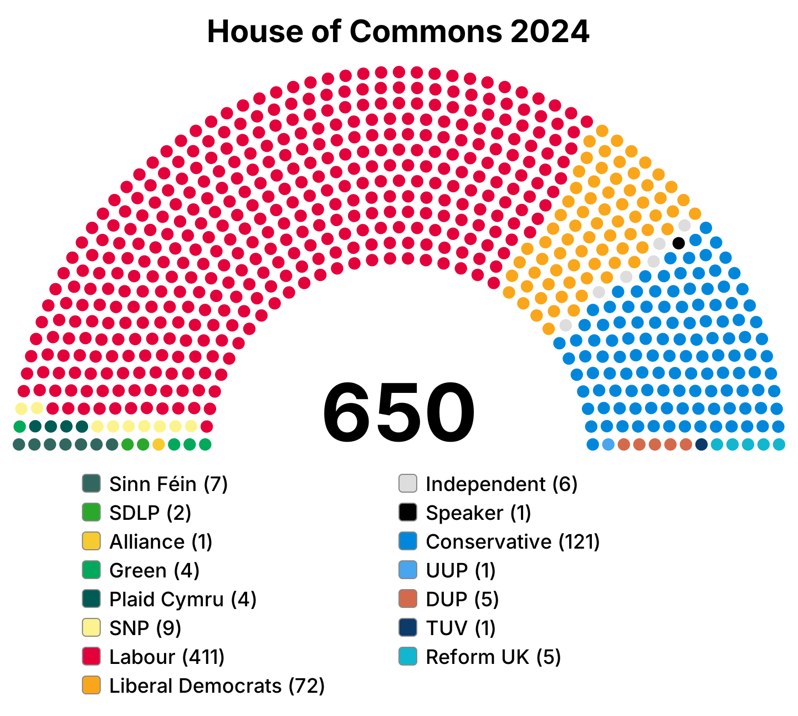

# Parliament diagrams

Make a hemicycle seating diagram from a plain list of parties. Instead of
adding every party by hand in the [parliamentdiagram](https://github.com/slashme/parliamentdiagram)
web form, write them in a text file and run one command. The seat layout comes
from [parliamentarch](https://pypi.org/project/parliamentarch/), the library
that tool uses, so the diagrams look the same.



## Setup

```sh
pip install -r requirements.txt
```

## Usage

1. Create a file in `parties/`, one party per line, **in seating order from left to right**:

   ```text
   title: My Parliament

   Greens, 12, #02A95B
   Social Democrats, 48, #E4003B
   Liberals, 20, #FAA61A
   Conservatives, 40, #0087DC
   ```

   Each line is `Party name, seats, color`. The color can be a hex code
   (`#E4003B` or `E4003B`) or a color name (`red`). Party names may contain
   commas. Lines starting with `#` are comments.

2. Run:

   ```sh
   python parliament.py parties/my-parliament.txt --png
   ```

   This writes `diagrams/my-parliament.svg` (and `.png` with `--png`).
   Use `-o some/path.svg` to write somewhere else, and `--scale` to change the
   PNG size (default 4, which gives a 1440px-wide image).

## Optional settings

Put any of these lines in the party file:

| Setting | Default | What it does |
| --- | --- | --- |
| `title: ...` | none | Title above the diagram |
| `legend: no` | `yes` | Hide the legend under the diagram |
| `number: no` | `yes` | Hide the total seat count in the middle |
| `dense: yes` | `no` | Fill the outer rows first, leaving the inner rows empty |
| `rows: 8` | automatic | Use at least this many rows (more rows = more spread out) |
| `span: 150` | `180` | Angle of the arc in degrees (180 = half circle) |

Parties with 0 seats are left out of the diagram and the legend.
