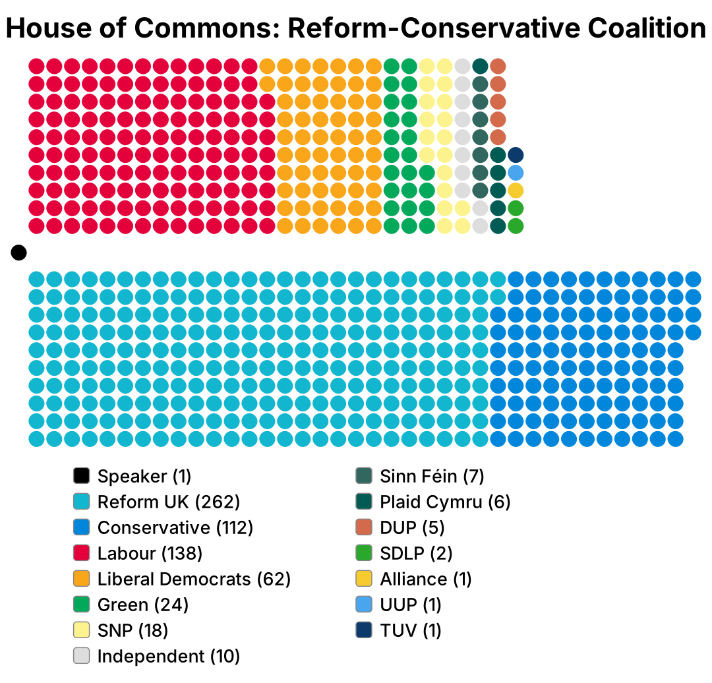
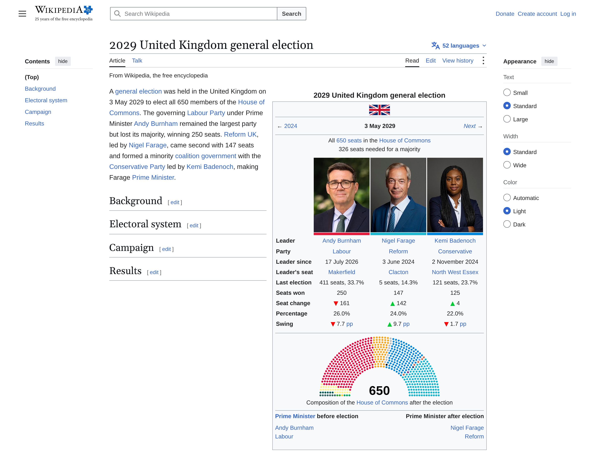
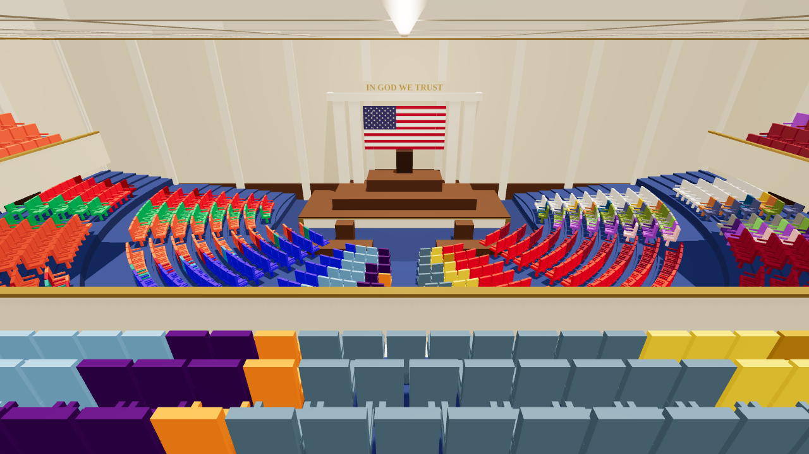
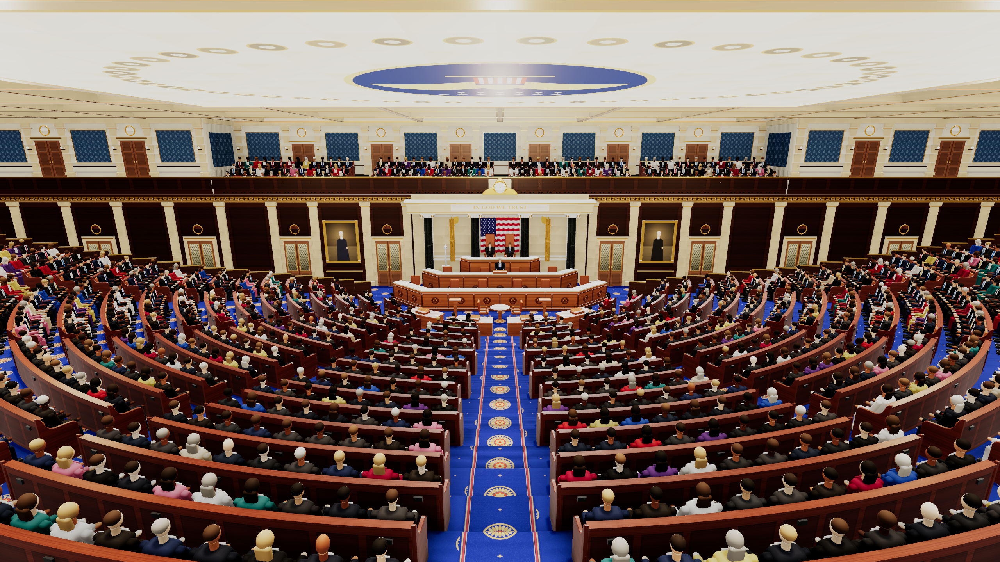

# Parliament diagrams and Wikipedia election pages

Tools for simulated elections:

- [`parliament.py`](#parliament-diagrams): seating diagrams from a list of parties
- [`wikishot.py`](#wikipedia-election-pages): Wikipedia article screenshots
  (desktop and mobile) with a real election infobox
- [`chamber.py`](#an-enlarged-house-chamber): 3D renders of an enlarged House of
  Representatives chamber

## Setup

```sh
pip install -r requirements.txt
python -m playwright install chromium   # for wikishot.py, if no Chromium is set up
```

## Parliament diagrams

Make a parliament seating diagram from a plain list of parties, either as a
hemicycle (arch) or in Westminster style (facing benches). Instead of
adding every party by hand in the [parliamentdiagram](https://github.com/slashme/parliamentdiagram)
web form, write them in a text file and run one command. The seat layout comes
from that tool (the [parliamentarch](https://pypi.org/project/parliamentarch/)
library for arches, its `westminster.py` for Westminster), so the diagrams look the same.




### Usage

1. Create a file in `parties/`, one party per line, **in seating order from left to right**:

   ```text
   title: My Parliament

   Greens, 12, #02A95B
   Social Democrats, 48, #E4003B
   Liberals, 20, #FAA61A
   Conservatives, 40, #0087DC
   ```

   Each line is `Party name, seats, color`. The color can be a hex code
   (`#E4003B` or `E4003B`) or a color name (`red`). Party names may contain
   commas. Lines starting with `#` are comments.

2. Run:

   ```sh
   python parliament.py parties/my-parliament.txt --png
   ```

   This writes `diagrams/my-parliament.svg` (and `.png` with `--png`).
   Use `-o some/path.svg` to write somewhere else, and `--scale` to change the
   PNG size (default 4, which gives a 1440px-wide image).

   `-s key=value` overrides a setting from the file without editing it. For a
   plain diagram exactly like the web tool's (no title or legend), for example
   to put in an infobox:

   ```sh
   python parliament.py parties/us-house.txt -s legend=no -s title= -o diagrams/us-house-plain.svg
   ```

### Westminster style

Add `style: westminster` and put the bench at the end of each party line:
`government`, `opposition`, `crossbench` or `speaker`.

```text
title: House of Commons
style: westminster

Speaker, 1, black, speaker
Labour, 411, #E4003B, government
Conservative, 121, #0087DC, opposition
Liberal Democrats, 72, #FAA61A, opposition
```

The Speaker sits at the left end, the government on the bottom benches and the
opposition on the top benches, with cross-benchers on the right. Within each
bench, parties are seated in the order listed, starting next to the Speaker.

### Optional settings

Put any of these lines in the party file:

| Setting | Default | What it does |
| --- | --- | --- |
| `title: ...` | none | Title above the diagram |
| `style: westminster` | `arch` | Diagram style |
| `legend: no` | `yes` | Hide the legend under the diagram |

Arch style only:

| Setting | Default | What it does |
| --- | --- | --- |
| `number: no` | `yes` | Hide the total seat count in the middle |
| `dense: yes` | `no` | Fill the outer rows first, leaving the inner rows empty |
| `rows: 8` | automatic | Use at least this many rows (more rows = more spread out) |
| `span: 150` | `180` | Angle of the arc in degrees (180 = half circle) |

Westminster style only (defaults match the web tool):

| Setting | Default | What it does |
| --- | --- | --- |
| `corners: 0` | `1` | Seat corner roundness: 0 = squares, 0.5 or more = circles |
| `spacing: 0.2` | `0.1` | Gap between seats, from 0 (touching) to 0.99 |
| `cozy: no` | `yes` | `no` starts each party in a new column |
| `fullwidth: yes` | `no` | Make the smaller wing thinner so both span the full width |
| `wingrows: 6` | automatic | Rows of seats in each wing |
| `crossbench-columns: 3` | automatic | Columns of seats in the cross-bench |

Parties with 0 seats are left out of the diagram and the legend.

## Wikipedia election pages

`wikishot.py` turns wikitext into screenshots of a Wikipedia article, the
same way it would look in a sandbox, without saving anything on Wikipedia:

```sh
python wikishot.py elections/uk-2029.wiki
```

writes three images to `screenshots/`:

| File | What |
| --- | --- |
| `uk-2029-desktop.png` | Desktop page (Vector 2022), top of the page down to the end of the infobox |
| `uk-2029-mobile.png` | Mobile page (en.m.wikipedia), same range |
| `uk-2029-infobox.png` | Just the infobox |



### How it works

Nothing is imitated. Wikipedia's own parser renders the wikitext with the real
templates (`{{Infobox election}}`, `{{Infobox legislative election}}`, party
colours, `{{increase}}` arrows and so on). The result goes inside a real
Wikipedia page, with Wikipedia's stylesheets and scripts, served at the
article's would-be address. Banners, surveys and analytics are blocked.
Rendering the real *2024 United Kingdom general election* wikitext this way
gives a pixel-identical infobox to the live article, on desktop and mobile.

Fonts are what most readers see: Arial and Georgia on desktop (Windows), Roboto
on mobile (Android). Rendering needs an internet connection: the text is sent
to Wikipedia's parse API, which renders it without saving it.

### Writing an article

A `.wiki` file has a few optional settings, a `---` line, then ordinary wikitext:

```text
title: 2029 United Kingdom general election
languages: 52
---
{{Infobox election
| election_name = 2029 United Kingdom general election
...
}}
A '''general election''' was held in the United Kingdom on 3 May 2029 ...

== Background ==
```

| Setting | Default | What it does |
| --- | --- | --- |
| `title:` | the infobox's `election_name` | Page title |
| `languages:` | `20` | Number on the "N languages" button (0 shows "Add languages") |
| `theme:` | `light` | `dark` for Wikipedia's dark mode |

Sections (`== Background ==`) fill the table of contents. The first paragraph
moves above the infobox on mobile, as it does on Wikipedia.

### Images

Anywhere the wikitext takes an image, three kinds work:

| Write | Gets |
| --- | --- |
| `image1 = Kamala Harris Vice Presidential Portrait (cropped).jpg` | A file on Wikipedia/Commons, as normal |
| `image1 = person:Nigel Farage` | The photo at the top of that person's Wikipedia article |
| `image1 = images/jane-doe.jpg` | A file from this repository (relative to the `.wiki` file or the repo) |

Local images are sized the way Wikipedia sizes uploads: scaled to fit the
infobox's box, never cropped. Seat diagrams from `parliament.py` work too
(`map_image = diagrams/uk-mrp-sept-2026-arch.svg`).

Commons has silhouettes for made-up people: `Male portrait placeholder cropped.jpg`
and `Female portrait placeholder cropped.jpg`.

### Infobox styles

| Style | Template | Example |
| --- | --- | --- |
| Presidential (candidates, running mates, electoral votes) | `{{Infobox election}}` with `type = presidential` | [`elections/example-presidential.wiki`](elections/example-presidential.wiki) |
| Parliamentary with leaders (photos, leader's seat, seats, swing) | `{{Infobox election}}` with `type = parliamentary` | [`elections/uk-2029.wiki`](elections/uk-2029.wiki) |
| List of parties (party, leader, %, seats, ±) | `{{Infobox legislative election}}` | [`elections/us-house-2026.wiki`](elections/us-house-2026.wiki) |

Every parameter of those templates works, since Wikipedia renders them. In the
list style, `noleader = yes`, `nopercentage = yes` and `first_election = yes`
hide the leader, vote share and seat change columns. `colourN` sets a party's
colour, and `partyN_link = no` shows `partyN` exactly as written instead of
Wikipedia's short party name. Use it to link a name yourself
(`[[Green Party of the United States|Green Party]]`) or to leave a made-up
party unlinked rather than red.

### Options

```text
--only desktop|mobile   render just one of them
--scale N               pixel density (default 2 for desktop, 3 for mobile, like a phone)
-o DIR                  output directory (default screenshots/)
```

## An enlarged House chamber

`chamber.py` designs a House chamber big enough for the 1,527 members in
`parties/us-house.txt` and renders it in 3D, made to look like today's Hall of the House,
empty or during a State of the Union.

```sh
python chamber.py                      # print the seat counts and render every view
python chamber.py --report             # just the seat counts
python chamber.py --views gallery-view --size 1280x720   # one quick preview
```




The fittings are today's: the three-tier walnut rostrum, the marble
frontispiece with its black columns, flag, fasces and clock, the portraits of
Washington and Lafayette, leaded-glass doors, the gilt Greek-key frieze, blue
damask upper walls, the coffered ceiling with its laylight, the blue carpet with
gold rosettes, and curved benches with leather seats and walnut backs.

### Does it fit?

Today's hall is 139 x 93 ft and 36 ft high, *galleries included* (Glenn Brown,
*History of the United States Capitol*), and today's seats come in pairs 52½ in
wide and 33 in deep (House collection). At that size, with rows 44 in apart, today's
hall could hold about 880 members even if all of it were seats, so 1,527 cannot fit in it.

So the new hall takes in almost the whole House wing, which is 238 ft 10 in by
142 ft 8 in outside. It keeps the outer walls and a corridor round the room. The
cloakrooms, lobbies and grand stairs around today's hall would have to go or move.

| | |
| --- | --- |
| Room | 210 x 110 ft (64.0 x 33.5 m), 36 ft high |
| Members | 25 tiers, 1,544 seats for 1,527 members (17 spare), real seat size |
| Public | 186 seats in 4 rows at the top, behind a rail and a glass screen |
| Total | 1,730 seats |

There are no separate galleries. The members' benches rise in one continuous
bowl from the well, and the outer rows run on into the corners of the room. The
public sits at the top, behind a walnut rail with a laminated-glass screen on
it, since visitors now sit just behind the members. The press gallery stays
above the rostrum.

Views (in `chamber/`):

| View | What |
| --- | --- |
| `gallery-view` | From the top of the bowl, facing the rostrum |
| `side-view` | From the public seats in a corner |
| `floor-view` | From a leadership table |
| `speaker-view` | From the rostrum |
| `party-seating` | From above, members' seats in their party colours (left-wing parties on the Speaker's right, as Democrats sit today) |
| `sotu-gallery`, `sotu-rostrum`, `sotu-president` | A State of the Union: every seat taken, the President at the rostrum, the Vice President and the Speaker behind |

The people are simple figures, not detailed humans: they look right from a
distance but have no faces close up.

Rendering uses [three.js](https://threejs.org/) in the same headless Chromium
as `wikishot.py`; the first run downloads three.js into `.cache/`.
